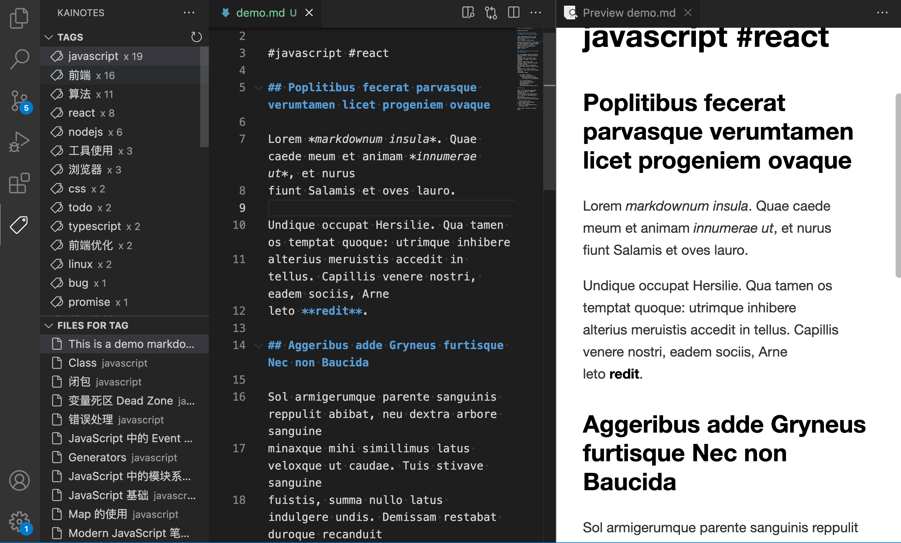
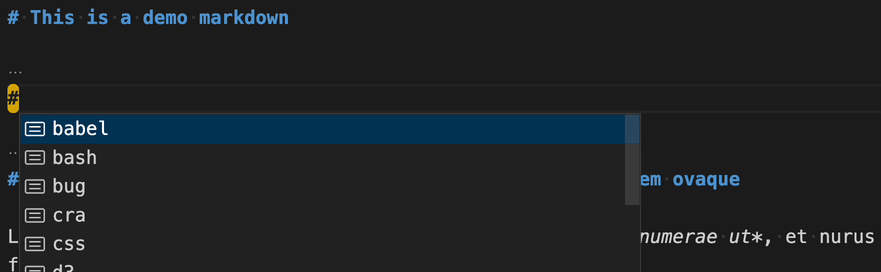
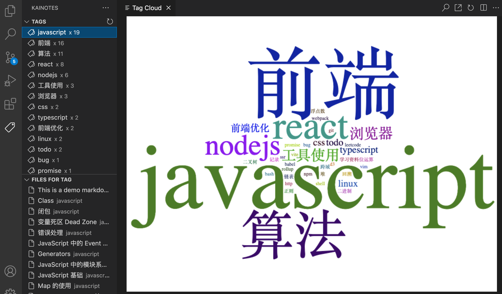

# KaiNotes README

KaiNotes provides a simple way to organize your markdown notes. When you add tags in your markdown files, you can easily find them in the sidebar. The files that contain the tag are displayed below. 

Tags are written like this: `#javascript #front-end #react`, starts with a hash symbol. You can add tag anywhere in your file. If you have used BearNotes before, you will find this function is similar.

## Features

This is a screenshot when i used KaiNotes extension together with Markdown Preview Enhanced.

When you input `#`，extension will list all tags you have used for you to choose.

KaiNotes offer a command to display all your tags as tag cloud. Use ⇧⌘P to open command palette, select `Tag Cloud`, and you will see your own tag cloud.

## Contact Me

If you have any suggestions or encounter any issues with this extension, please feel free to get in touch with me using the following methods:

Email: wukai2048@gmail.com
GitHub Issues: https://github.com/noiron/KaiNotes/issues

I look forward to hearing from you and appreciate your feedback!
